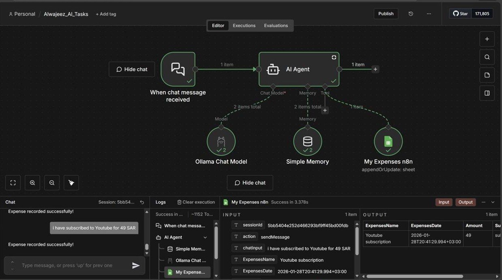
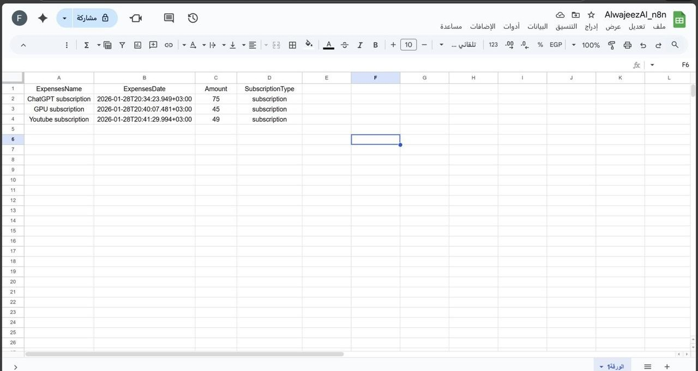

# AI Expense Tracker Agent

> An AI-powered expense tracking workflow built with n8n, Ollama, and Google Sheets.  
> The workflow extracts expense details from natural language input and records them automatically in a structured Google Sheet.

---

## 📌 Project Summary

This project demonstrates how an AI Agent can understand a simple expense message, extract key information, and store it automatically in Google Sheets.

Example user message:

```text
I subscribed to YouTube for 49 SAR
```

The AI Agent extracts:

| Field | Example |
|---|---|
| Expense Name | YouTube subscription |
| Amount | 49 |
| Date | Current date |
| Category | Subscription |

---

## ⚙️ How the Workflow Works

```text
User Message
     ↓
n8n Chat Trigger
     ↓
AI Agent
     ↓
Ollama Chat Model
     ↓
Google Sheets Tool
     ↓
Expense Recorded
```

---

## ✨ Key Features

| Feature | Description |
|---|---|
| Natural Language Input | Accepts simple expense messages written by the user |
| AI Extraction | Extracts expense name, amount, date, and category |
| Google Sheets Integration | Saves the extracted data into a structured spreadsheet |
| Local LLM Support | Uses Ollama as the local chat model |
| n8n Automation | Automates the full workflow from input to storage |
| Simple Memory | Supports the AI Agent during the workflow execution |

---

## 🛠️ Tools & Technologies

<p>
  
  
  
  
</p>

| Tool | Purpose |
|---|---|
| n8n | Building and running the automation workflow |
| Ollama | Running the local LLM |
| Google Sheets | Storing extracted expense records |
| Docker | Running the local n8n environment |
| Simple Memory | Supporting the AI Agent workflow |

---

## 📸 Screenshots

### n8n Workflow



### Google Sheets Output



---

## 📂 Repository Structure

```text
AI-Expense-Tracker-n8n-Agent/
│
├── README.md
├── .gitignore
├── n8n-workflow.jpeg
├── google-sheets-output.jpeg
│
└── workflow/
    └── expense-tracker-workflow.json
```

---

## 🔐 Privacy & Security Note

This repository does not include:

- API keys
- Google credentials
- Telegram bot tokens
- Private Google Sheet links
- Personal access tokens

The uploaded workflow file is sanitized for public sharing.  
Anyone importing the workflow into n8n will need to connect their own Google Sheets and Ollama or (any LLMs) setup .

---

## 🚀 Future Improvements

- Add Telegram input support to record expenses directly through a Telegram bot
- Improve date handling for inputs such as “today”, “yesterday”, and specific dates
- Add more expense categories such as food, transportation, subscriptions, shopping, and bills
- Generate weekly and monthly expense summaries


---

## 🎯 What I Learned

Through this project, I practiced:

- Building AI automation workflows using n8n
- Connecting an AI Agent with external tools
- Using Google Sheets as structured storage
- Designing prompts for structured information extraction
  

---

## ✅ Project Status

Completed as a practical training project.  
Future improvements may be added as the workflow evolves.
